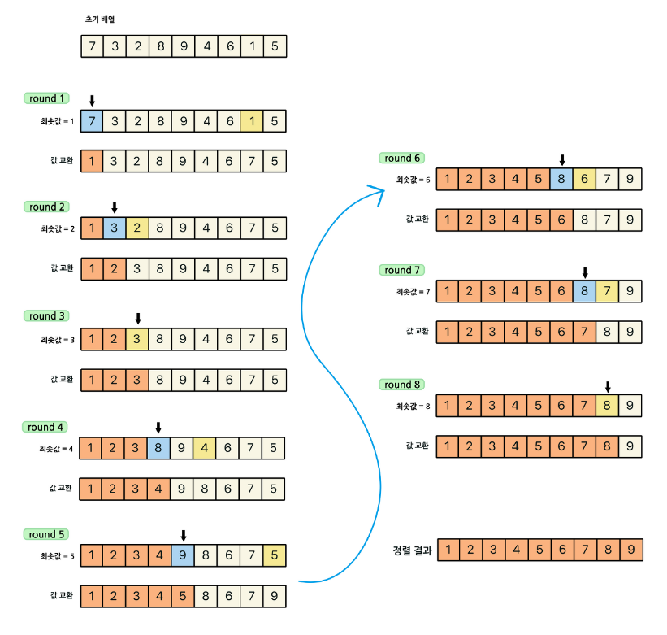

## ⚡ 선택 정렬 알고리즘

> 참고 : https://st-lab.tistory.com/168

### ✅ Selection Sort [선택 정렬] 

- 현재 위치에 들어갈 데이터를 찾아 선택하는 알고리즘.
- 데이터를 비교하면서 찾기 때문에, '비교 정렬'이라 지칭한다.
- 정렬의 대상이 되는 데이터 외에 추가적인 공간이 필요하지 않음.
  - 제자리 정렬(in-place sort)
- 정확히는 데이터를 교환하는 과정(swap)에서 임시 변수를 필요로 한다.
  - 충분히 무시할 만큼 적은 양의 임시 변수.
- <u style="text-decoration: none; border-bottom: 1px solid rgb(238, 238, 86); padding-bottom: 0px; ">불안정 정렬</u>

### ✅ 정렬 방법

1. 주어진 리스트에서 **최솟값**을 찾는다.
2. **최솟값**을 **맨 앞 자리의 값**과 교환한다.
3. 맨 앞자리를 제외한 나머지 값들 중 최솟값을 찾아 위와 같은 방법으로 반복한다.

### 🔥 정렬 예제

 
마지막 round9를 안하는 이유는 앞 인덱스부터 순차적으로 정렬해나가기 때문에 N개의 데이터 중 N-1개가 정렬 되어있다는 것은 결국 마지막 원소가 최대값이라는 말이기에 이는 정렬이 되어있는 상태로 판단하고 굳이 참조를 하지 않는다.